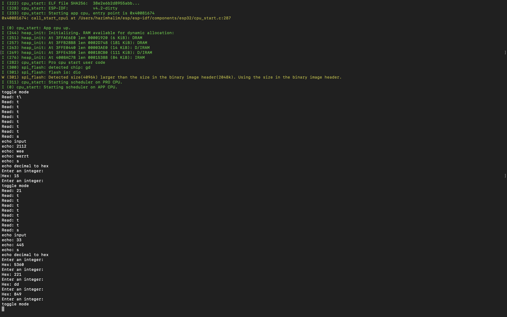

#  CONSOLE IO

Author:  Hazim Halim

Date: 2021-02-09
-----

## Summary
This code will take input from a keyboard and will display the output on the terminal. 
There's 3 mode that the user can cycle through; Toggle mode which will turn on/off the built in LED on the ESP32 board, echo mode which will just display any input from the keyboard, and the decimal to hex mode which will convert a decimal int, cinvert it to hex and display the result on the terminal. Pressing 's' will enable the user to cycle through the modes.

*******JUST A NOTE, ALTHOUGH THE FILE NAME IS BLINK, IT CONTAINS THE CODE FOR CONSOLE IO SKILL. I DON'T KNOW HOW TO CHANGE THE FILE NAME WITHOUT EVERYTHING FALLING APART*******

## Sketches and Photos

## Modules, Tools, Source Used Including Attribution

## Supporting Artifacts

-----
