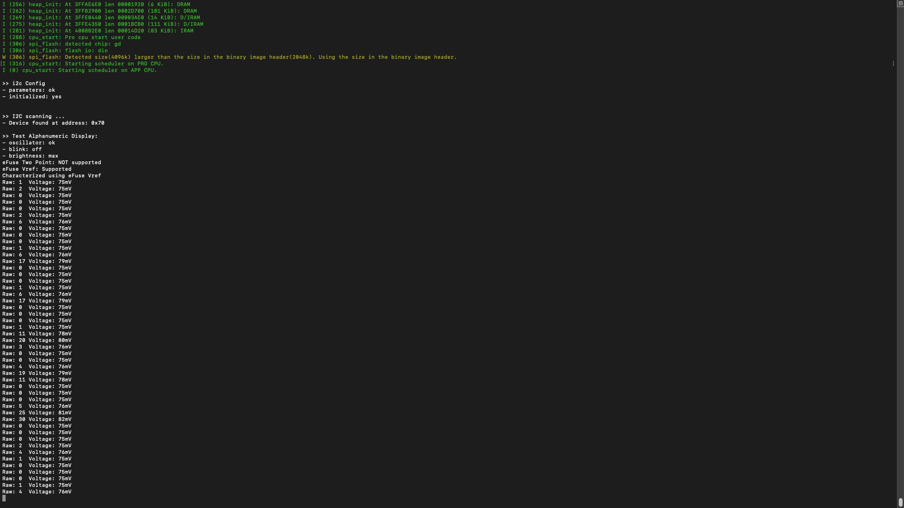

#  Battery Volt Monitor

Author: Hazim Halim

Date: 2021-03-01
-----

## Summary
This skill uses ADC to measure the raw value transmitted to GPIO34.
The it'll use the ADC library to convert the raw value to millivolt (mV)
It also uses the a voltage divider to make sure the voltage supplied is in the acceptable range

## Sketches and Photos

## Modules, Tools, Source Used Including Attribution

## Supporting Artifacts

-----
