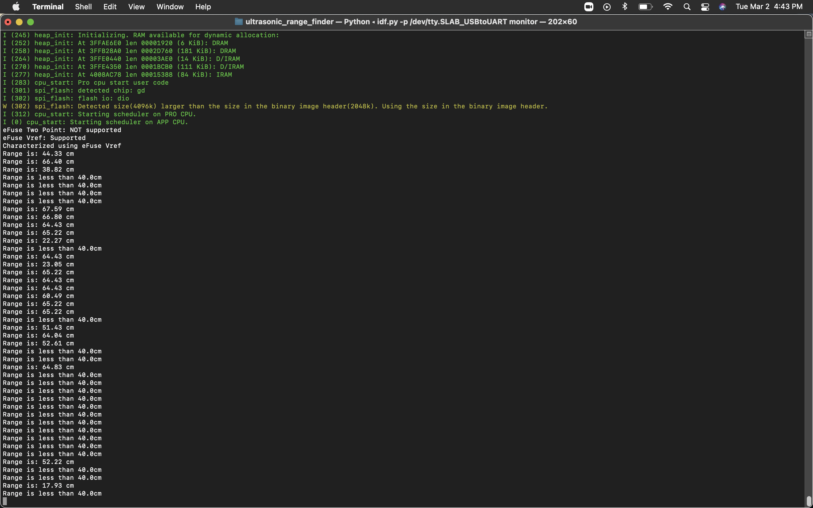

#  Ultrasonic Range Finder

Author:  Hazim Halim

Date: 2021-03-01
-----

## Summary
This skill uses the ultrasonic sensor to find the range between an object and the sensor
The sensor's analog output is used to get the ADC reading.
The reading is then used to convert to voltage. 
It is then used to convert to distance
https://www.maxbotix.com/documents/HRLV-MaxSonar-EZ_Datasheet.pdf
Used this datasheet to find a suitable equation to convert voltage to distance.
## Sketches and Photos

## Modules, Tools, Source Used Including Attribution

## Supporting Artifacts

-----
