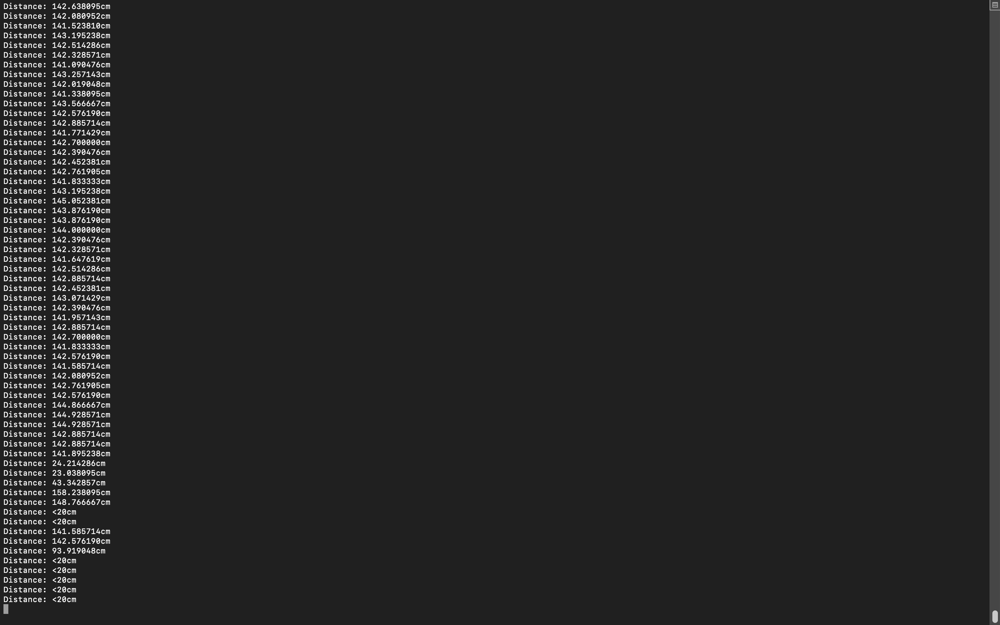

#  IR Range Finder

Author: Hazim Halim

Date: 2021-03-01
-----

## Summary
This skill uses the IR Range finder to measure the distance between the sensor and the object.
By using the datasheet, I used a constant, (130/2100). Multiplied it with the voltage measured from the ADC and the result is the distance.

## Sketches and Photos

## Modules, Tools, Source Used Including Attribution

## Supporting Artifacts
https://www.sparkfun.com/datasheets/Sensors/Infrared/gp2y0a02yk_e.pdf

-----
