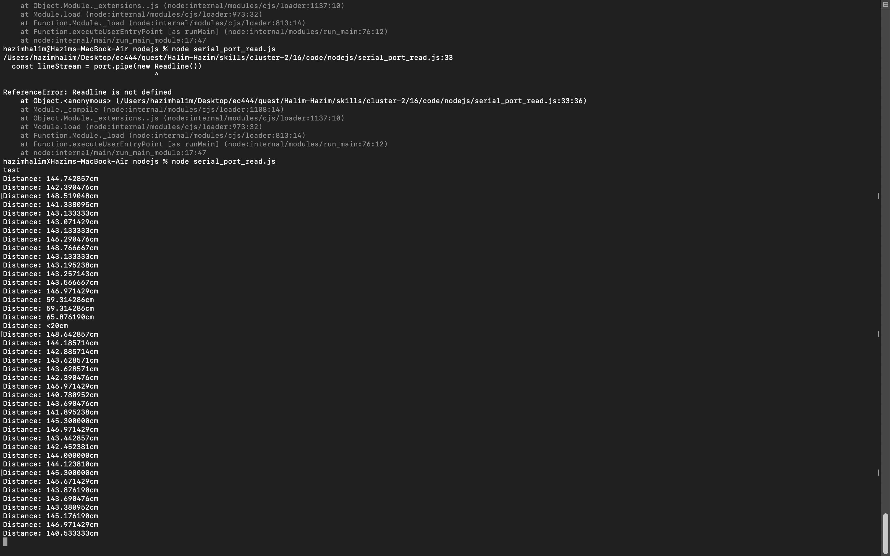

#  NodeJs

Author: Hazim Halim

Date: 2021-03-01
-----

## Summary
This skill is focused on the basics of using NodeJS 
From the W3 School website, I followed the lessons to do the following modules:

 1) HTTP module
 2) URL module
 3) NPM
 4) Events

There is also a file which enables the user to read from the serial port and write the result
on the console just by running the nodeJS file

## Sketches and Photos

## Modules, Tools, Source Used Including Attribution

## Supporting Artifacts
https://www.w3schools.com/nodejs/default.asp
https://serialport.io/docs/guide-usage
-----
