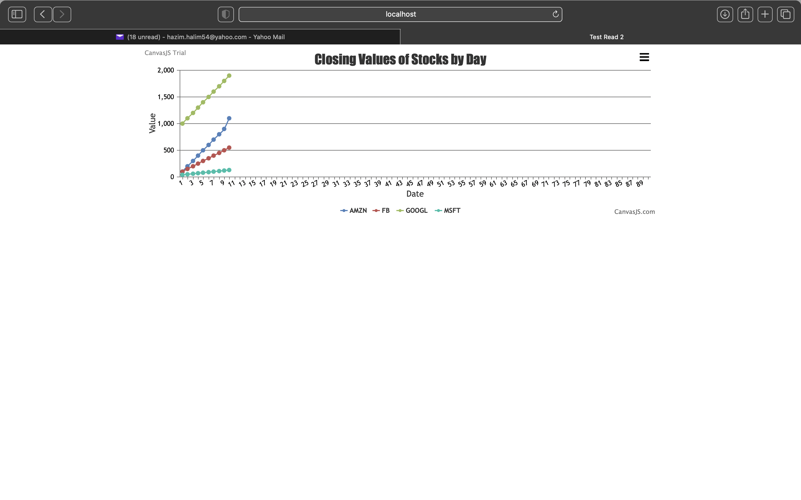

#  CanvasJS

Author: Hazim Halim

Date: 2021-03-03
-----

## Summary
This skill uses canvasJS to graph the stocks data contained in a csv format.
The html file designs the chart while NodeJS is used to host the server for the graph

## Sketches and Photos

## Modules, Tools, Source Used Including Attribution

## Supporting Artifacts

-----
