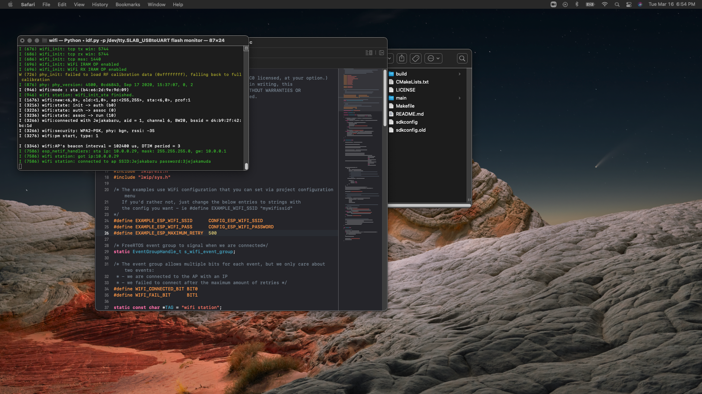

#  ESP WiFi

Author: Hazim Ab Halim

Date: 2021-03-15
-----

## Summary
This skill is to configure and setup the WiFi module on the ESP. Setting up the WiFi involves changing the SSID and Password configuration in the menuconfig.

## Sketches and Photos

## Modules, Tools, Source Used Including Attribution

## Supporting Artifacts

-----
