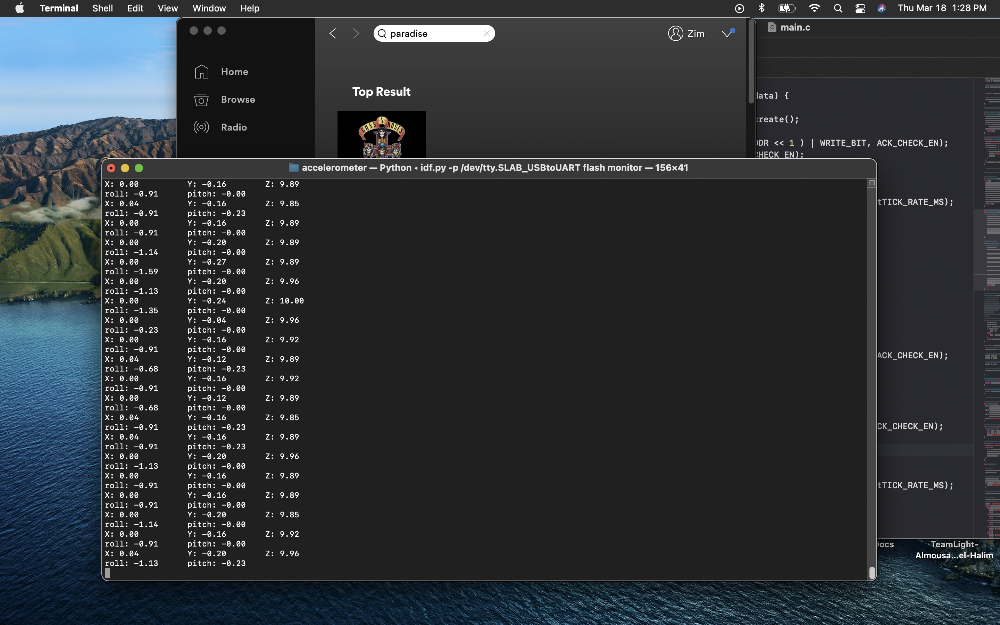
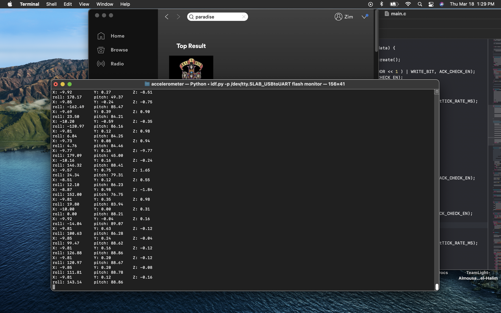

#  Acceletometer
Author: Hazim Ab Halim

Date: 2021-03-18
-----

## Summary
This skill uses the i2c accelerometer to calculate the roll and pitch of the device.
The i2c uses a communication between the master device and slave device which will rad and write bytes with each other. A 16 bits binary is sent to the ESP and will be converted to engineering units.

Result images are posted in various position of the sensor
## Sketches and Photos

## Modules, Tools, Source Used Including Attribution

## Supporting Artifacts

-----
