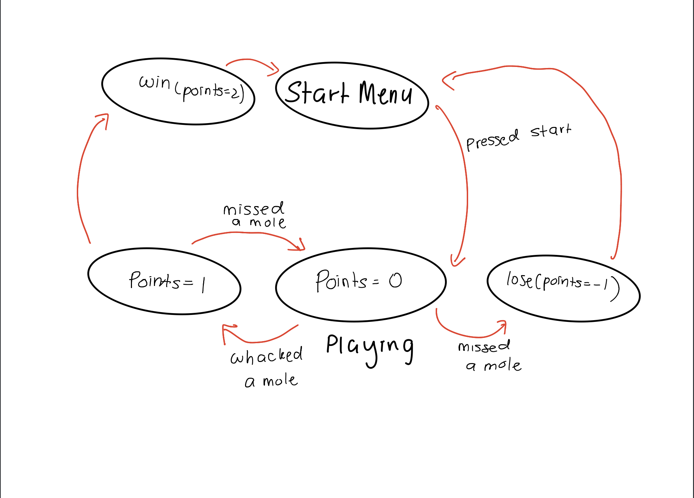

#  FSM

Author: Hazim Ab Halim

Date: 2021-04-13
-----

## Summary
This skill explores the concept of FSM. Once an event happened, the state of the FSM will move one step in the appropriate direction. Specifically for this skill, I'm tasked to create an FSM for a whack-a-mole game. 
The states are as follows :
    1) Start Menu
    2) Playing
    3) Points=1
    4)Win
    5)Lose
    
The connections are displayed in the sketch below

## Sketches and Photos

## Modules, Tools, Source Used Including Attribution

## Supporting Artifacts

-----
