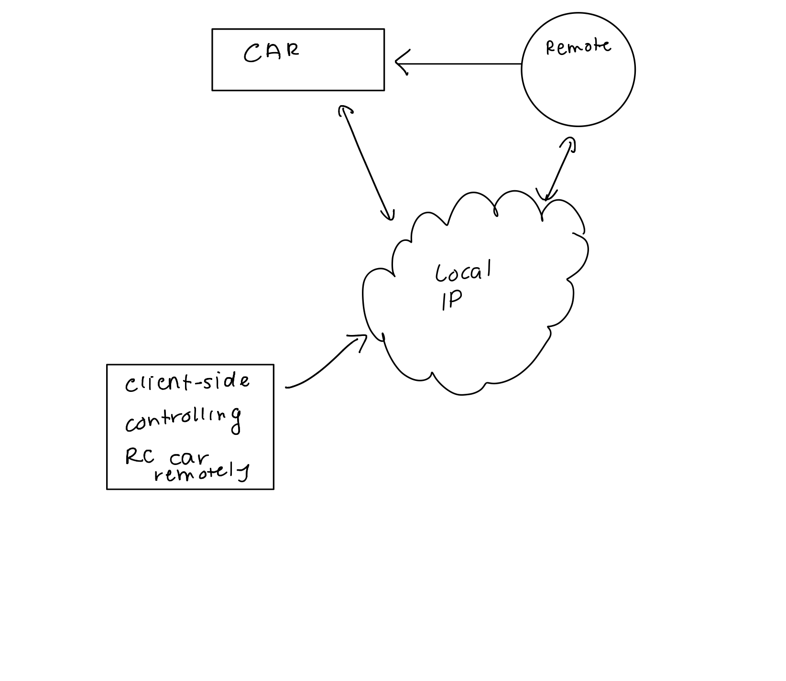

#  Security Issues

Author: Hazim Ab Halim

Date: 2021-04-13
-----

## Summary
This skill describes some of the ways someone could hijack the systems of a remote control car that works over the internet

1) RC car's instructions can be spoofed by a bad actor who knows the IP address of the car. They can send malicious instructions directly to the car. To overcome this, we can include an authentication key which is included in the signal sent by the client-side to the local IP. That way, only a specific client can control the car
2) The webpage server can also be hijacked by a bad actor. They can insert malicious instructions directly to the server. A way to overcome this event is by having another device that can check if the instructions from the server and the client-side are similar
3) Someone can disrupt the local internet connection which will then sever the communication between the client and the car. A way to overcome this is by having a backup connection that be used by the system
4) Someone can act as the client and deliver malicious instructions. It can be mitigated by only allowing one client at a time which will increase the chances of having a secure connection.
5) A bad actor can spoof the IP address of the local internet connection. A safe way to mitigate this is by reducing the distance between the client and the car. This can work because there's less router that the signal has to go through so it's easier to secure the connection from one router that multiple routers.

## Sketches and Photos

## Modules, Tools, Source Used Including Attribution

## Supporting Artifacts

-----
